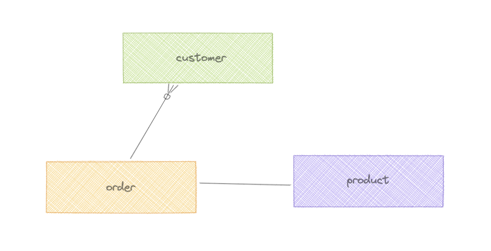

# Skin + Me
We are on a mission to change the face of skincare, and we’d love for you to join us. Right now, there’s a huge problem in the world of skincare: people don’t just struggle with their skin – they struggle with how they’re supposed to deal with it.
The truth is that getting great skin isn’t complicated. It’s actually just about using the right combination of prescription-strength ingredients, with a stripped-back supporting routine. Simple, right?
We believe it should be. We’re united in the belief that everyone should have access to expertise, effective derm-strength ingredients and treatment plans that result in clear, healthy skin – just without the big price tag and the long dermatologist waitlist that usually comes with it.
 
# Values
We are thoroughly committed to and live by our values;
 
## Embrace the unknown
Building an incredible brand from scratch comes with challenges, and we're ok with that. In fact, we're thrilled and driven by it. We're autonomous in our forging of new, exciting paths every day. And we embrace the inevitable ambiguity and uncertainty of start-up life with courage, conviction, thoughtful communication.
 
## Obsess over customer delight
It goes without saying that our customers are at the core of everything we do. Right now, in their lives, they're fed up with the skincare world and the false promises from products that never work. We frame every decision on their happiness at the heart, which means we grow a loyal group of brand advocates whose lives are better because of what we do.
 
## Challenge and be challenged
Coldplay once sang 'Nobody said it was easy', and we agree. Every day presents new challenges, and our job to rise up to them, then challenge them ourselves. We ask questions (across every area of the business). Then we question the answers. In return, we're open to getting the same back. Because in the long run, we know we'll all be better for it.
 
# About you
You are an energetic and passionate professional with strong communication skills who is as keen to acquire knowledge as you are to share it. You can demonstrate a high degree of competence using our core toolset; AWS, Docker, Python, Flask, SQLAlchemy, Alembic, MySQL and github. You enjoy solving problems and are equally at ease maintaining our existing code base as you are writing new code. You work as well in small teams and you do on projects independently, interacting with key stakeholders as required to achieve positive outcomes.
 
# Scope
The purpose of this test is to convey an understanding of your technical competency. You don’t need to complete the task in its entirety but instead you will demonstrate a clear understanding of the problem, a structured approach to problem solving and complete enough elements of the task to show us that you are a good programmer who clearly understands how to best use our toolset. We expect this test to take between **1 and 2 hours** to get it to a respectable point for further discussion.
 
# Task
 
## Purpose
The purpose of the task is to get an understanding of how you would approach a problem like this, demonstrate some of your core technical skills and to serve as a basis of the follow-up interview which will be conducted with the Engineering Manager and one of our Senior Developers.
 
## Requirement
Add a subscription billing feature to our fictional system.
 
### Billing regime
Customers can be billed at various intervals; monthly, quarterly or annually for one or more products which they can add at any time. Customers are always billed on the anniversary of buying the product. For clarification, if the product was added on the 3rd of the month and monthly billing is selected then they will be billed on the 3rd of every month.
 
### Billing provider
The fictional billing provider offers a RESTful API that allows us to post payments and refunds and to enquire about the outcome of events. There is also a webhook interface which can be used to receive events.
 
### Existing schema
Our schema records details about the customer along with any products they have ordered.


### The task
Please extend the current system to support the following;
 
* produce a mechanism to bill customers on their annual billing interval.
  * consider what audit & logging is needed to ensure the integrity of the process.
  * the system will continue to try and charge customers up to 5 days after the billing date before the subscription is terminated.
* implement an interface that will allow the billing provider's webhooks to communicate events to your system. Of all the events supported, implement;
  * `payment-outcome`: This may be `success` or `failure`. If `failure` then a reason is provided.
  * `refund`: A refund for a given payment along with the refund reason.
  * `card-unavailable`: The customer’s card has `expired` or been `cancelled`. In such an event the customer will not be charged at their next billing cycle but the subscription will be cancelled instead.
* alter the database to support the new functionality adding columns and tables as required.
* restructure any elements of the app to make it a little more standard/well structured.

## Scope
**This is obviously a broad task. The intention is to allow you to demonstrate a variety of skills to the degree you feel comfortable. Any elements of the system you don't implement can be annotated so we can get an understanding of what you would have done, given time and opportunity**. This is not intended to be a robust production system. The purpose of the assessment is to show your Python, Flask and SQLAlchemy skills. Please also see [Hints and Tips](/#hints-and-tips), below.

# Prerequisites
- Python 3.8
- MySQL

We would expect the application to run under gunicorn, although that is out of scope of this assessment.

### Additional considerations
Other items of interest include;
* Alembic and data migration tasks
* How the billing process would be run in production
* Security considerations
* Scalability
* Pre-commit environment
* CI/Github Actions workflow

There is no action to be performed here, necessarily. We will discuss some of these topics in our interview so we can understand your thoughts a little more. 
 
### Enhancements
We might want to make some changes in the future. Please classify the following tasks as Large, Medium or Small in the context of the work you have done in this assessment. The intention isn't to do the task but to simply state if the change would be complex (Large) or something that was low risk and simple (Small).
* Reconciliation - we might want to periodically reconcile our database with our billing partner's records.
* Alternative provider - we might want to add another payment provider.
  * Any single customer can only use one payment provider.
  * Each payment provider loosely uses the same architecture (RESTful API and webhooks) but the payloads differ and the data types and geometry vary.
  * Each payment provider's security approach differs. One uses Webhook Signatures whilst the other uses Session based Token Exchange over an IPSec tunnel.
* We have decided to send a personalised email via our CRM system on each successful billing event.
* As the billing provider charges for every billing event, we might align billing requests for customers with multiple products so that multiple products are charged at the same time.


# Hints and Tips
1. We do not expect you to do the whole assessment in its entirety.
2. Pytest might be a good way to prove the webhook endpoints and show us your pytest foo, killing two birds with one stone.
3. Consider using SQLite if MySQL is not an option. Obviously update the `requirements.txt` accordingly.
4. Don’t do the whole assessment. I know we have mentioned this already but it’s important enough to repeat!

# Build
To get you started we have created a basic app. Start by cloning the repo, update the configuration, install the Python libraries, create the database tables and run the tests.

## Installation
```bash
python -m venv .venv
source .venv/bin/activate
pip install -r app/requirements.txt
```

## Configuration
1. Update `SQLALCHEMY_DATABASE_URI` in `app/assessment/api.py` to use your database connection string.
2. Define the environment variable `APP_ENCRYPTION_KEY` to any value to act as your encryption key.

## Create the database and run the tests
Check that everything is setup and configured properly by running the tests.

```bash
cd app
python create_database.py
python -m pytest -v
```

## Run the server
The run the server;
```bash
(cd app && FLASK_APP=application:app FLASK_ENV=development flask run --host 0.0.0.0 --port 9000)
```
## Done
You are now ready to start the assessment.

## No MySQL server?
We appreciate you might not have a spare MySQL server lying about. Consider using [a MySQL Docker container](https://hub.docker.com/_/mysql) or make use of an [SQLite](https://www.sqlite.org/index.html) instance instead. Obviously change the `requirements.txt` file if you elect to use SQLite.

# Results
We would like you to create a private repository in your github account and commit your code to it. We would urge you to commit relatively frequently so we can get an idea of your style and approach. Once you are happy with your work please add @tfranceuk and @mikepassey and we’ll review your submission immediately! 👏
